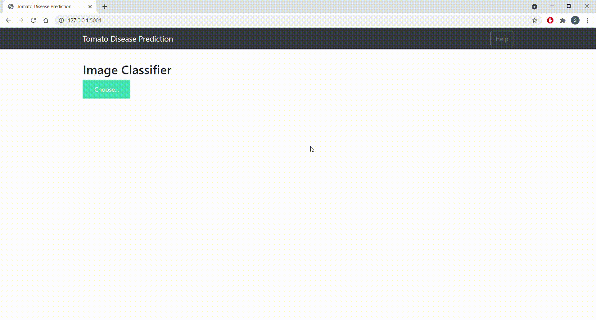

## Tomato Disease image classification with InceptionV3

In this model is trained to classify the images of the tomato plant whether it is healthy or a diseased leaf


## DataSet
The data set is divided into 3 folders train,test and val. Each of the folder contains the 10 different folders for different diseases of the plant
- Tomato___Bacterial_spot
- Tomato___Early_blight
- Tomato___healthy
- Tomato___Late_blight
- Tomato___Leaf_Mold
- Tomato___Septoria_leaf_spot
- Tomato___Spider_mites Two-spotted_spider_mite
- Tomato___Target_Spot
- Tomato___Tomato_mosaic_virus
- Tomato___Tomato_Yellow_Leaf_Curl_Virus
 
 ## Data source link
 
 Kaggle
 https://www.kaggle.com/kaustubhb999/tomatoleaf

  
## Technologies Used

 - Python 3.6
 - Flask
 - jQuery
 - CSS
 - HTML
  
## Run Locally

Clone the project

```bash
  git clone git@github.com:schandrab22/Tomatodisease.git
```

Go to the project directory

```bash
  cd my-project
```

Install dependencies

```bash
  pip install -r requirements.txt
```

Start the server

```bash
  run app.py
```

  
